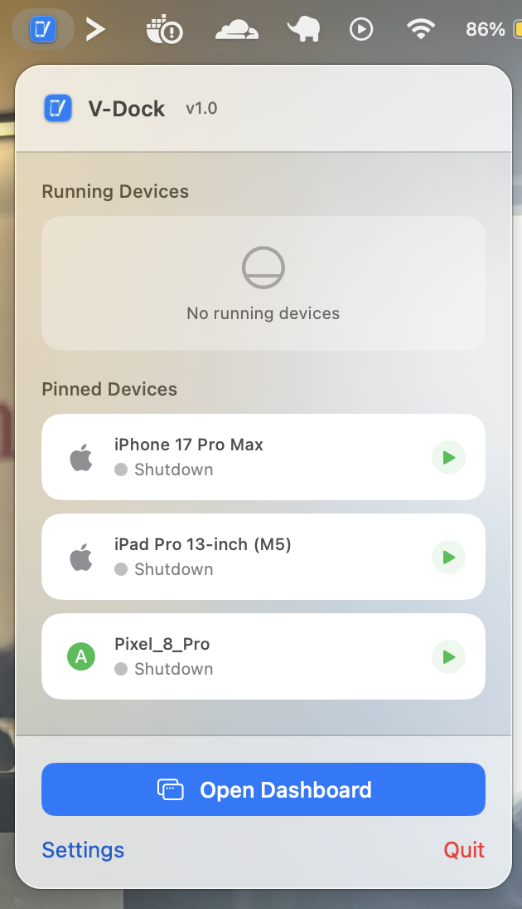
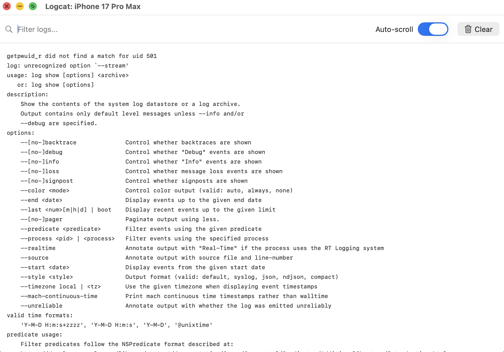
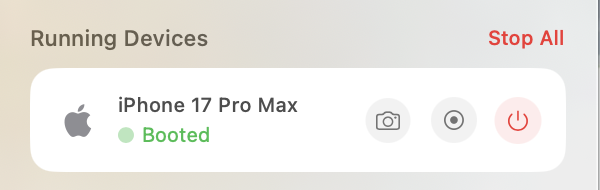
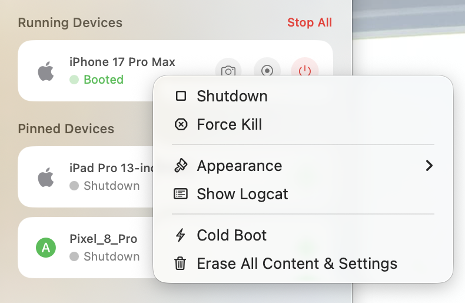

<div align="center">
  
  <h1>V-Dock</h1>
  <p><strong>The Ultimate macOS Control Center for Mobile Developers</strong></p>

[](https://developer.apple.com/xcode/swiftui/)
[](https://www.apple.com/macos/)
[]()
[]()

</div>

<br/>

V-Dock is a lightning-fast, native macOS Menu Bar utility designed to streamline the workflow of iOS and Android developers. Manage, boot, and terminate your iOS Simulators and Android Emulators instantly without ever opening Xcode or Android Studio.

---

## ✨ Highlight Features

### 🚀 Menu Bar Mastery

V-Dock lives quietly in your macOS Menu Bar. Click the V-Dock icon to reveal all your iOS Simulators and Android Emulators.

- **One-Click Boot & Shutdown:** Click the power icon next to any device to boot or terminate it instantly.
- **Pin Favorite Devices:** Right-click a device and select "Pin" so your daily drivers always stay at the very top.
- **Overflow Menu (⋯):** Access file push, screenshot, and screen recording from a single compact menu on each device row.



---

### 📤 Cross-Platform File Transfer & App Installer (Drag & Drop)

Push media, documents, and even install apps seamlessly to both iOS Simulators and Android Emulators using an intuitive Drag & Drop interface or the built-in file picker.

- **Bulk Upload & Install:** Select or drag multiple files and apps at once. V-Dock processes them concurrently.
- **Auto App Installation:** Drop an `.apk` (Android) or `.app` (iOS Simulator build) and V-Dock will attempt to install it on the device. > ⚠️ **Note:** This feature is experimental and may not work reliably in all cases.
- **Smart Routing:** Media (.png, .jpg, .mp4) routes to Photos/Gallery. Documents (.pdf, .txt) go to the Files app. Unsupported formats divert intelligently.
- **How to use:** Drag & Drop files onto any running device card, or click the overflow menu (⋯) ➔ **Push File**.

---

### 🛠 Context Actions (Right-Click Menu)

Right-click any device to unlock a suite of powerful developer tools:

#### 1. 📋 Mini Logcat / Console Viewer

Stream device logs into a native macOS window without opening Android Studio or Xcode.

- **How to use:** Right-click an active device ➔ **Show Logcat**.
- **Features:** Real-time streaming, syntax highlighting (Errors/Warnings), auto-scrolling, and live search filtering.



#### 2. 📸 Quick Media Capture

Capture screenshots or record the screen—saved instantly to your Desktop.

- **How to use:** Click the overflow menu (⋯) on any active device ➔ **Take Screenshot** or **Start Recording**.
- **Result:** Automatically saved to your Mac's Desktop with a notification.



#### 3. 🌙 Appearance Toggles

Test your app's UI in dark and light themes effortlessly.

- **How to use:** Right-click an active device ➔ **Appearance** ➔ **Dark Mode** or **Light Mode**.
- **Result:** Instantly forces the OS-level theme change.


#### 4. 🧹 Factory Reset & Cold Boot

Start fresh without digging through deeply nested settings.

- **How to use:** Right-click any device ➔ **Erase All Content & Settings** (iOS) or **Wipe Data** (Android) / **Cold Boot**.
- **Behavior:** iOS Simulator shuts down, erases, then reboots automatically. Android Emulator restarts with a clean user data image.



---

### 📶 Wireless ADB & Device Pairing

Pair physical Android 11+ devices over Wi-Fi—no terminal required.

- **How to use:** Click the **Pair Wireless** button at the bottom of the V-Dock Menu Bar.
- **Features:** Pair via QR code or manual pairing code. Auto-discovers services on the local network via mDNS.

---

### 🔔 Desktop Notifications

V-Dock sends macOS native notifications for key events:
- Device boot complete
- Screenshot/recording saved
- File transfer or app install complete
- Wireless pairing success or failure

Notifications appear as banners and respect macOS Focus modes.

---

### 🥷 Under The Hood

- **Stealth Hybrid Mode:** Runs as a Menu Bar accessory (`.accessory`). When opening the Dashboard, promotes to a regular app (`.regular`) with Dock icon and keyboard shortcuts.
- **Dynamic Activation Policy:** Automatically reverts to `.accessory` when all windows are closed.
- **Native Shortcuts:** `Cmd + Q`, `Cmd + W`, `Cmd + ,`, `Cmd + R` work reliably via low-level `NSEvent` monitors.
- **Swift Concurrency:** Uses `async/await` and `AsyncStream` for non-blocking shell execution.

---

## 🏗 Architecture

Built using **Clean Architecture** principles:

### 1. Presentation Layer
SwiftUI Views with custom `NSWindow`/`NSHostingView` for full lifecycle control.
_Key: `MenuBarView.swift`, `DashboardView.swift`, `SettingsView.swift`_

### 2. Domain Layer
Business logic and state management. `AppState` (`@Observable`) is the single source of truth.
_Key: `AppState.swift`, `Device.swift`_

### 3. Data Layer
Shell command execution (`simctl`, `emulator`, `adb`) via `ShellExecutor`.
_Key: `ShellExecutor.swift`_

---

## 🚀 Getting Started

### Prerequisites

- macOS 14.0+
- Xcode 15.0+
- Android SDK (optional, for Android Emulator support)

### Installation

1. Clone the repository:
   ```bash
   git clone https://github.com/yourusername/V-Dock.git
   ```
2. Open `V-Dock.xcodeproj` in Xcode.
3. Build and Run (`Cmd + R`).

### Configuration

For Android Emulator support, open V-Dock Settings (`Cmd + ,`) and set your Android SDK path (typically `/Users/YOUR_USERNAME/Library/Android/sdk`).

---

## 🤝 Contributing

Contributions, issues, and feature requests are welcome!

1. Fork the Project
2. Create your Feature Branch (`git checkout -b feature/AmazingFeature`)
3. Commit your Changes
4. Push to the Branch
5. Open a Pull Request

---

<div align="center">
  <p>Built with ❤️ for the Community</p>
</div>
